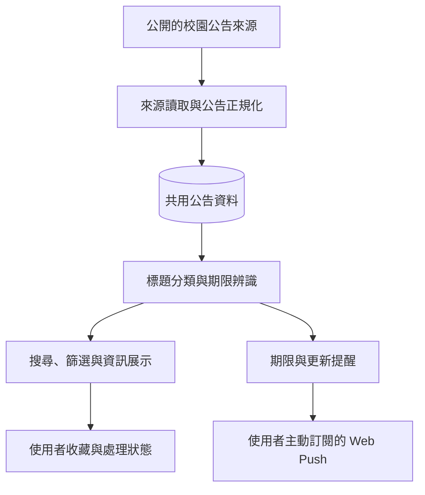

# 中原機會雷達｜架構概覽

本頁描述產品的**公開高階架構**，不提供正式部署金鑰、內部管理員資訊、真實資料匯出或可直接重現正式環境的設定。

## 資料分工

- **共用公告**：蒐集已接入來源的公開資訊，儲存標題、公告來源、連結與必要欄位。需要登入才能取得的公告不列入公開資料收集。
- **分類與日期**：標題分類可能使用 AI 輔助；期限辨識需依據公告原文，無法確定時保留待確認。
- **個人化**：只有使用者登入後，才儲存其偏好、收藏與提醒等個人狀態；個人資料與共用公告分離。
- **通知**：在使用者主動允許裝置通知後，才保存裝置訂閱並發送提醒。

## 技術

Web 前端使用 React／TypeScript，伺服器端使用 Vinext 與 Cloudflare D1，登入支援 Google OAuth，通知使用標準 Web Push。

## 界限

網站的資料來源與功能仍持續擴充。資訊的完整性、期限及參與資格，均應以相應主辦單位官方公告為準。此文件不是部署手冊，也不包含安全敏感設定。
